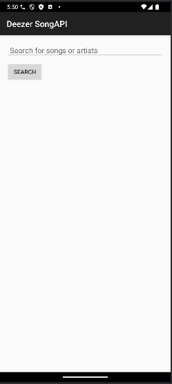
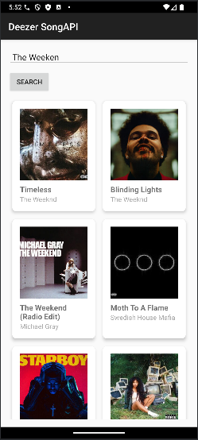

# SongAPI

## Esittely

**SongAPI** on Android-sovellus, joka on suunniteltu musiikin ystäville, jotka haluavat löytää ja tutkia laajaa kappalepankkia. Tämä sovellus hyödyntää musiikkisovellusta tarjoavaa APIa tarjotakseen käyttäjille reaaliaikaista pääsyä kappaletietoihin, kuten nimiin, artisteihin, albumikansiin ja paljon muuhun. Intuitiivisen käyttöliittymän ja monipuolisten toimintojen avulla **SongAPI** mahdollistaa käyttäjille suosikkikappaleidensa etsimisen, yksityiskohtaisen kappaletiedon tarkastelun ja saumattoman musiikin löytämiskokemuksen.

## Keskeiset ominaisuudet

- **Hakuominaisuus**: Etsi nopeasti kappaleita nimellä tai artistilla löytääksesi rakastamasi musiikin.
- **Kaunis käyttöliittymä**: Moderni ja käyttäjäystävällinen käyttöliittymä, joka parantaa musiikin löytämiskokemusta.
- **Reaaliaikaiset tiedot**: Hae kappaletietoja tehokkaasta musiikkisovellusta tarjoavasta APIsta varmistaaksesi, että sinulla on aina ajankohtaista tietoa.
- **Albumikansikuvat**: Näe upeat albumikannet yhdessä kappaletietojen kanssa rikastuttaaksesi visuaalista kokemusta.
- **Virheenkäsittely**: Selkeää palautetta käyttäjille virhetilanteissa hakujen tai tietojen noutamisen aikana.

## Teknologiapino

- **Android SDK**: Kehitetty uusimpia Android-teknologioita ja parhaita käytäntöjä hyödyntäen.
- **Retrofit**: Verkko-osoitteiden käsittelyyn kappaletietojen hakemiseksi.
- **Gson**: JSON-datan jäsentämiseen APIsta.
- **Coil**: Kuvien, erityisesti albumikansien, tehokkaaseen lataamiseen.
- **ViewModel & LiveData**: Käyttöliittymän kannalta tärkeiden tietojen hallintaan elinkaaritietoisuutta noudattaen.

## Projektin kuvia

